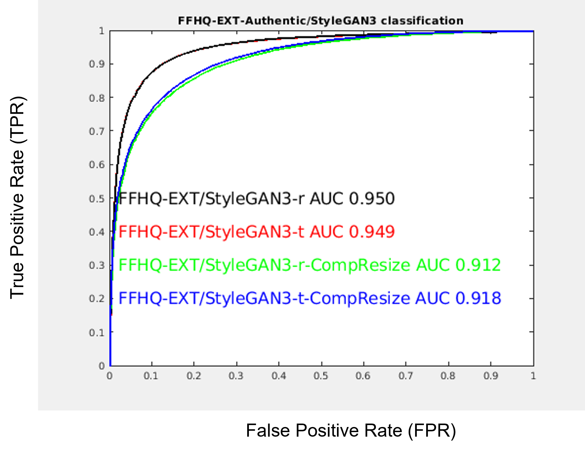
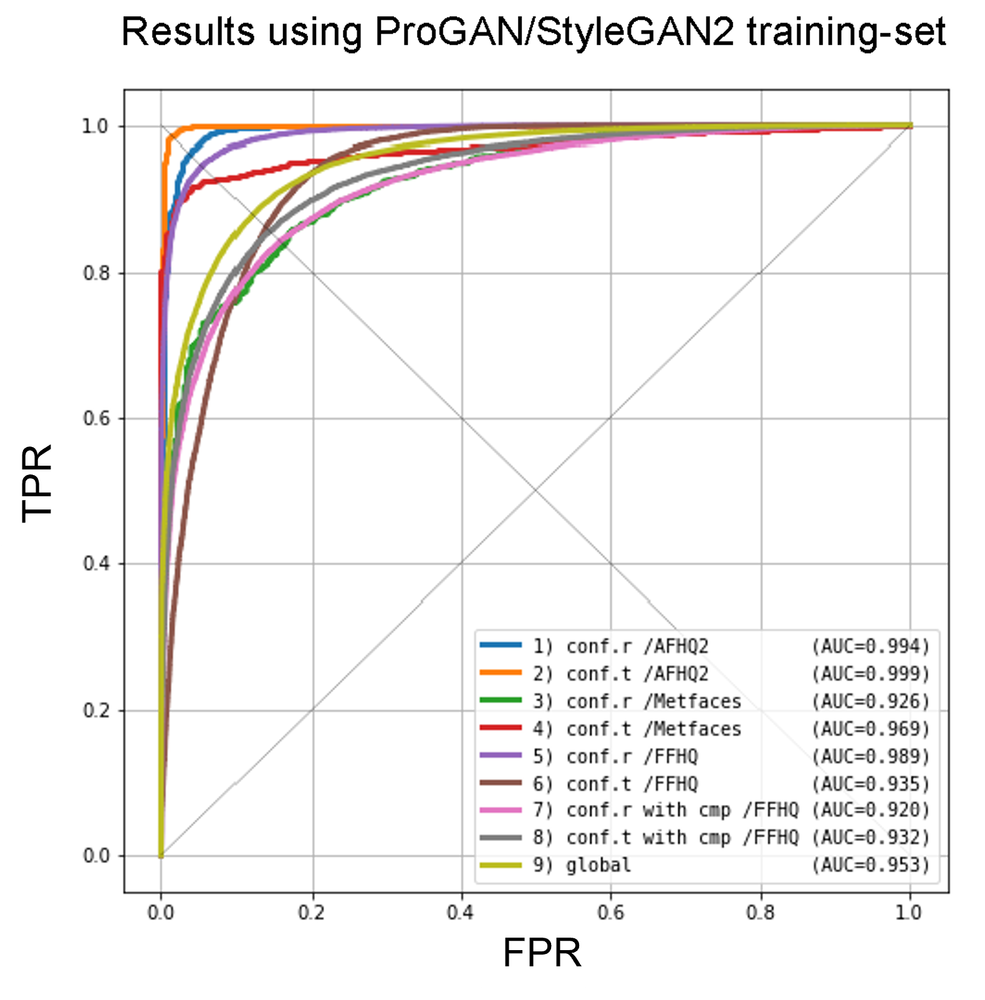
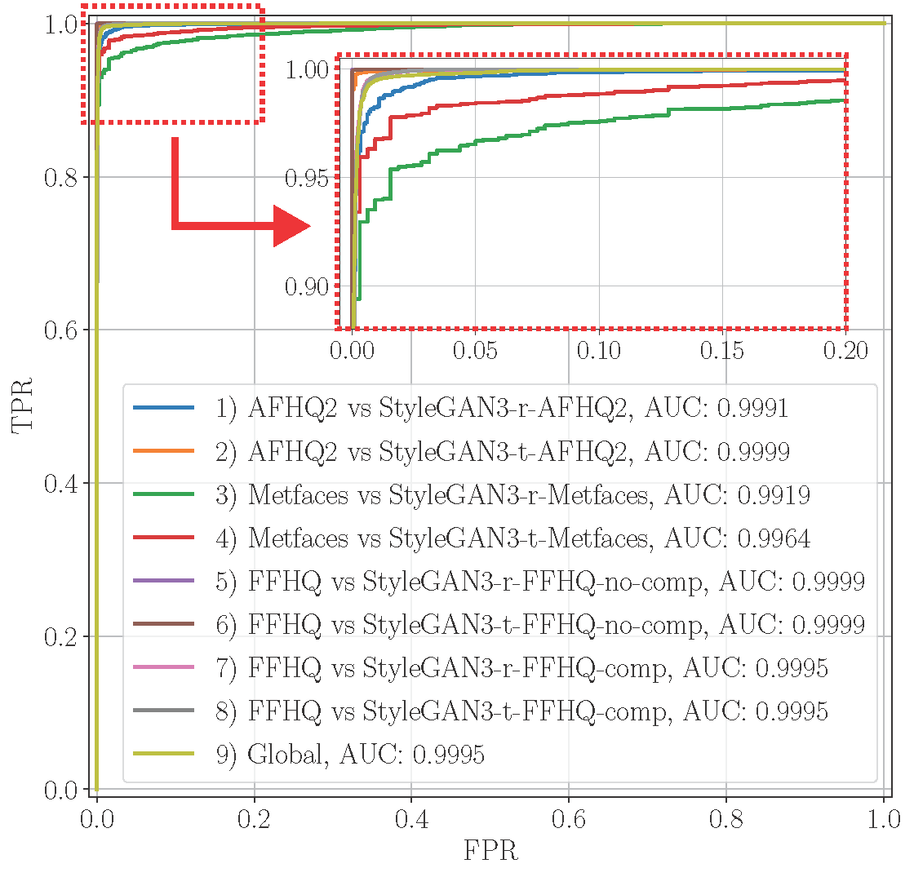
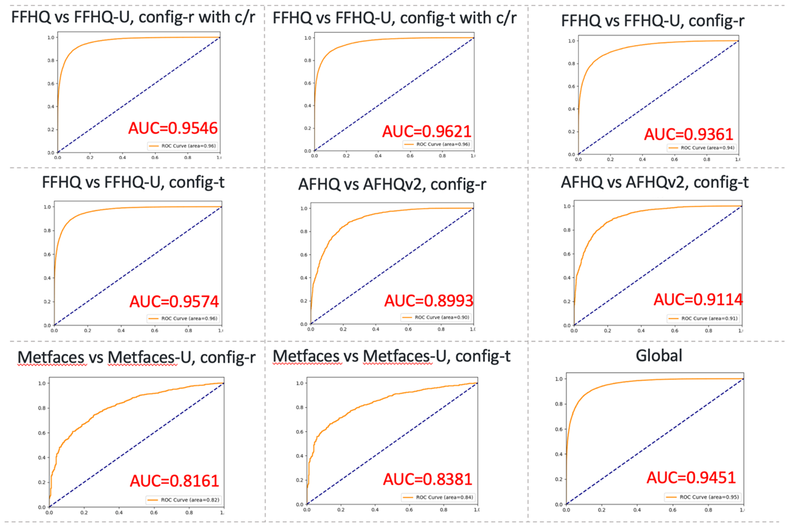

## StyleGAN3 Synthetic Image Detection

**Overview**

While new generator models, such as [StyleGAN3](https://nvlabs.github.io/alias-free-gan/), enable new media synthesis capabilities, they may also present a new challenge for AI forensics algorithms for detection,  attribution, and characterization of synthetic media.

As part of DARPA's [Semantic Forensics](https://www.darpa.mil/program/semantic-forensics) (SemaFor, for short) program, NVIDIA has been collaborating with digital forensics experts and researchers to help advance the capabilities to verify the authenticity and provenance of synthetic media.

In advance of the public code release of the StyleGAN3, we curated a test dataset of images generated by StyleGAN3 and provided them to the forensics researchers who are collaborating on the SemaFor program. This dataset allowed the researchers to validate the performance of their synthetic image detectors on the previously unseen generator model (i.e., StyleGAN3).

By ensuring the released StyleGAN3 code is well studied and tested in advance by forensics researchers, we hope to help establish a precedent and culture of responsible and thoughtful code release in the community related to media synthesis research.

We are releasing this github page simultaneously with the main [StyleGAN3 codebase](https://github.com/NVlabs/alias-free-gan), reporting the summary of the StyleGAN3 detection challenge results as well as highlighting the work of the researchers working in this domain to combat visual mis/disinformation.

Below, we will describe the detection challenge problem setup and summarize the key results by different research teams.

## Detection Problem Setup 
The problem setup simulates the open-world setting, in which we wish to know whether we can reliably detect a previously unseen, state-of-the-art image generator (e.g., StyleGAN3). Hence, all of the detector models below are NOT trained with any StyleGAN3 image samples at all. For more details about the training data and setup used for each detector, please refer to each team's project page linked below. 

**Testing Data**

We prepared the following dataset of the synthetic and real images for testing the accuracy of the detectors. For the synthetic test data, we used StyleGAN3 with the configurations and datasets below:

1. FFHQ-U, config-t (20K images)
2. FFHQ-U, config-r (20K images) 
3. FFHQ-U, config-t with compression/resizing (20K images)
4. FFHQ-U, config-r with compression/resizing (20K images) 
5. AFHQv2, config-t (10K images)
6. AFHQv2, config-r (10K images)
7. Metfaces-U, config-t (10K images)
8. Metfaces-U, config-r (10K images)

Please refer to the StyleGAN3 paper for more details about the configurations and datasets. For FFHQ-U synthesized images, we also prepared a version with compression and resizing to simulate the common real-world scenario in which images have (intentionally or unintentionally) gone through some kind of image laundering. Specifically, we applied random resizing of the range [256,300,384,512,640,768,1024] and JPEG compressionwith quality factors [30, 50, 70, 80, 90, 95]. All together, they formed the synthetic image datasets for testing.

For the real test image datasets, unless noted, we reserved the last 20K FFHQ images, the "test" folder of the AFHQv2 dataset, and the last 336 images of the MetFaces datasets. None of these images were used in the detector training. In addition, 27K unreleased FFHQ images that are not a part of the original 70K FFHQ images were shared with the SemaFor collaborators for their optional inclusion as an additional real image test dataset.

**Evaluation**

For evaluating detection accuracy, we follow common practice in forensics research and report  the area under the curve (AUC) metric for the receiver operating characteristic (ROC) curves. A short explanation of ROC curves and AUC may be helpful for those unfamiliar with these concepts. 

Intuitively, a ROC curve plots the fraction of “true positives” detected against the fraction of “false positives” one is willing to tolerate. In our case, a “true positive” is a correctly identified synthetic image, and a “false positive” is a real image that is incorrectly identified as synthetic. In such a plot, better results are “up and to the left”, meaning that the system identifies most synthetic images as such without incorrectly labeling many real images as synthetic. A perfect detector able to always detect both real and synthetic images has an AUC 1.0 and the ROC curve converged to the top left corner.

In more detail: Typically, a detector gives some kind of floating point score (say, between 0 and 1), and it needs to make a final binary decision (i.e., real or synthetic). To do so, it needs to pick a threshold (e.g., above 0.5 is synthetic and below is real). However, deciding a single threshold needs to consider the probability of an image classified as synthetic at the cost of possibly incorrectly classifying a real image as synthetic. The ROC curves are generated by evaluating multiple thresholds and can tell us how well the detector could have performed if we picked the right threshold.

The ROC curve takes the True Positive Rate (e.g., accuracy of correctly classifying synthetic image as synthetic) and False Positive Rate (e.g., accuracy of incorrectly classifying real image as synthetic) for the vertical and horizontal axis. When the threshold is 1.0, everything is detected as real (negative class) and a point is drawn at the origin (0,0). When the threshold is 0.0, everything is detected as synthetic (positive class) and another point is drawn at the top right corner (1,1). Evaluating at a threshold 0.5 gives yet another point somewhere in between and repeating this for all the thresholds between 0 and 1 produces the ROC curve. An ideal detector can correctly classify 100% of synthetic images (i.e., TPR=1.0) while incorrectly classifying 0% of real images (i.e., FPR=0.0). So one way to know how good the detector is to measure how close its ROC curve is to the top left corner, and the area under the curve (AUC) is used as such a measure. On the ROC curves, the random guess is a straight line from the origin to the top right corner and has an AUC of 0.5. See [here](https://en.wikipedia.org/wiki/Receiver_operating_characteristic) for more details about ROC curves.

## Results 
In this section, we provide a brief summary of the detection method and highlight the main results by different teams. 
Please see each team's project page for more detailed descriptions of the method and additional results. 

**UMD Team** : https://github.com/yaseryacoob/GAN-Scanner

The [GAN-Scanner](https://github.com/yaseryacoob/GAN-Scanner) developed by the University of Maryland team "employs [StyleGAN2](https://github.com/NVlabs/stylegan2) inversion as the core-idea for detection. The hypothesis is that a perfect inversion of a face is highly likely to indicate a GAN generated image, while a real-image is slightly less invertible. Multiple metrics are used to compute a feature vector that reflects the quality of the inversion. The computed feature is then scored (range 0-1.0, where 0 is likely a GAN image and 1.0 is an authentic image)." This detector is specialized for detecting face images and achieved up to AUC **0.918** (with compression) or **0.95** (without compressions) on StyleGAN3 synthesized FFHQ-U images. 

  

**UNINA Team** : https://github.com/grip-unina/GANimageDetection 

The detector developed by the University Federico II of Naples team is based on  "_Are GAN generated images easy to detect? A critical analysis of the state-of-the-art_" by Gragnaniello et al., ICME 2021. Using a variant of Resnet50 as a CNN backbone and multiple classes of images for training (LSUN, AFHQv2, MetFaces, FFHQ etc., but not StyleGAN3 images), this detector is designed to work for images including animals, churches, paintings, and human faces, reporting consistently high AUC results for all the categories. This team compared the two versions of detectors trained with (1) [ProGAN](https://github.com/tkarras/progressive_growing_of_gans) images and (2) ProGAN/StyleGAN2 images, both reporting the global AUC of **0.95**. Please see the [ppt slides](./slides/GAN_detector_Unina.pdf) for additional descriptions and results.

  

**PoliMi Team** : https://github.com/polimi-ispl/GAN-image-detection 

The detector developed by the Politecnico di Milano team employs 5 detectors using EfficientNet-B4 as a backbone and the final score for the test image is derived by averaging among the scores obtained by the 5 detectors. The 5 detectors are trained using a specific image dataset and / or image processing operations (e.g., JPEG compressions) to help generalization to multiple image categories and to diverse sets of image processing. The team demonstrates the detection results on multiple categories of images, reporting AUC **0.99** for all the test image datasets, regardless of the image compression and resizing. Please see the [ppt slides](./slides/polimi_sg3_detection.pdf) for additional descriptions and results.

**Buffalo Team** : https://gitlab.com/littlejuyan/GAN-generated-image-detector  

The detector developed by the University at Buffalo, MDFL lab team, uses ResNet-50 as a backbone to fuse a whole image and patch features for GAN-generated image detection. Two datasets (20 classes LSUN and FFHQ) were used as pristine training datasets and also the synthetic images generated by ProGAN and StyleGAN2 using the same datasets. The detector shows AUC **0.94** for all test datasets including unseen datasets (AFHQ and Metfaces). The results are consistent with compression/resizing (AUC **0.96**) or without (AUC **0.95**) on FFHQ config-t, implying the robustness to image processing. Please see the [ppt slides](https://gitlab.com/littlejuyan/GAN-generated-image-detector/-/blob/main/GAN-detector.pdf) for additional descriptions and results.

## Final Remarks 
By crafting a challenging dataset from previously unseen, state-of-the-art media generation algorithms, we aimed to provide crucial information to researchers developing and testing detector algorithms for new, highly realistic AI images. Such detectors can help identify and analyze synthetic images to combat visual misinformation.

In this exercise, we did not focus on a scenario where the researchers train or fine-tune their detectors using StyleGAN3 generated images. While such known GAN detection is also an important task, we focused on the more challenging and important "open-world" scenario, where we are interested in how reliably a detector can identify synthetic images generated by a never-before-seen synthetic image generator.

While we used an ROC curve for the evaluation in this exercise, the ROC curve or the right threshold is not available in advance for a previously unseen generator for which we don't have ground truth labels of synthesized images. The synthetic image dataset from the new generator provides another data point for the forensic detectors to calibrate their scores for detecting images from generators including StyleGAN3 in the future.

The open-world detection results above not only show that the existing detection algorithms are effective at identifying images from StyleGAN3, but also suggest the forensic research field is advancing on the more difficult problem of detecting images from previously unseen generators.

We hope this exercise inspires more people to participate in forensics research, and that the lessons learned here will help advance research on combating visual misinformation.

For the full background of this StyleGAN3 detection, please refer to our [corporate blog post](). 

## Acknowledgements
This material is based upon work supported by the US Defense Advanced Research Projects Agency (DARPA) under Contracts No.R00112030005, HR001120C0123, HR001120C0124 and FA8750-20-2-1004 and the Air Force Research Laboratory (AFRL) under Contract No. FA8750-20-2-1004. Any opinions, findings and conclusions or recommendations expressed in this material are those of the author(s) and do not necessarily reflect the views of DARPA or AFRL. Distribution Statement "A" (Approved for Public Release, Distribution Unlimited).
